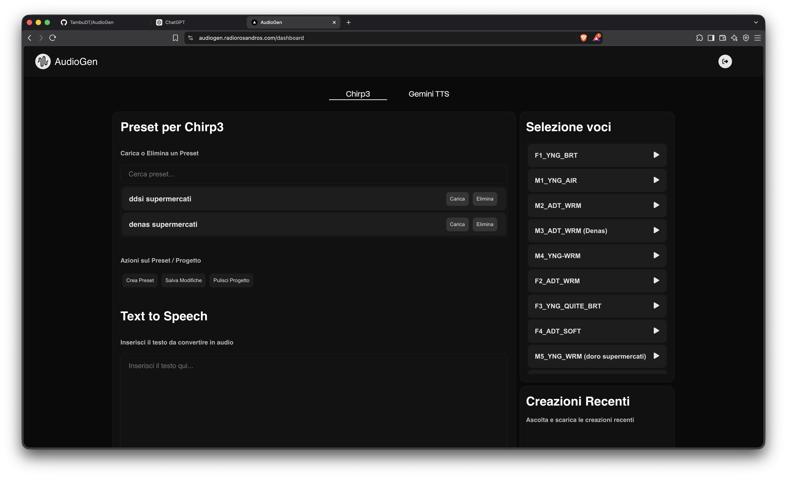
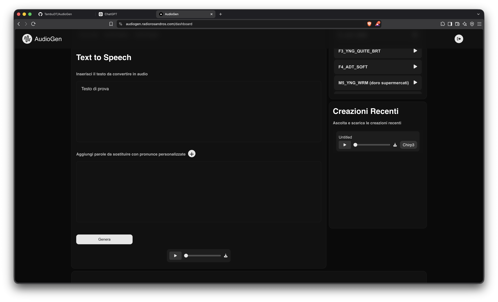
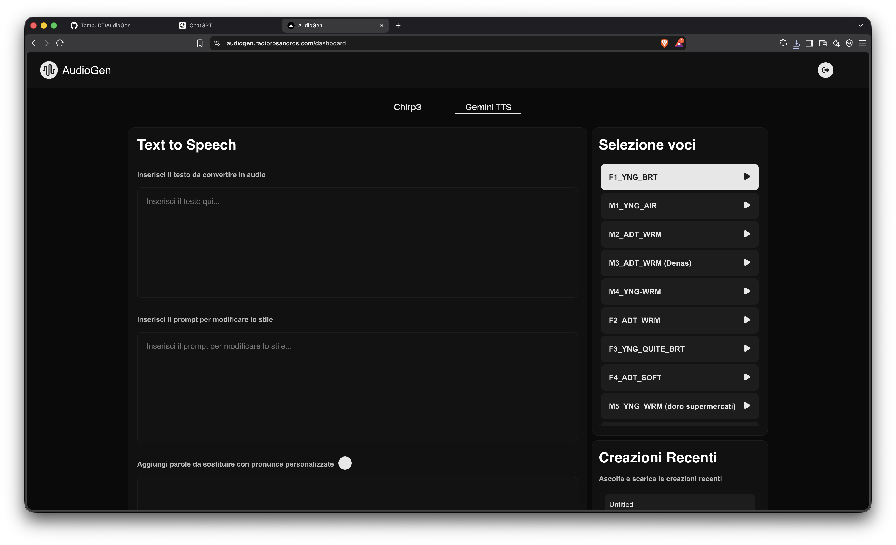
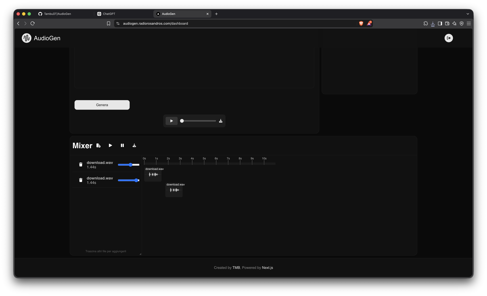

# AudioGen

<p align="center">
  <strong>AudioGen</strong><br>
  Genera, ascolta e assembla contenuti audio con l'intelligenza artificiale.
</p>

<p align="center">
  <a href="https://github.com/TambuDT/AudioGen">Repository</a> ·
  <a href="https://github.com/TambuDT/AudioGen/issues">Segnala un problema</a>
</p>

AudioGen è una web app per trasformare testo in audio, scegliere voci sintetiche, salvare preset e organizzare più clip in un mixer direttamente dal browser.

## Demo



## Funzionalità

- **Text to Speech**: converte un testo in una traccia audio.
- **Due modalità vocali**: Chirp3 e Gemini TTS.
- **Selezione e anteprima delle voci**: ascolta i sample disponibili prima di generare l'audio.
- **Prompt di stile**: con Gemini TTS puoi descrivere lo stile desiderato per la voce.
- **Pronunce personalizzate**: associa parole a pronunce specifiche.
- **Preset**: salva, carica ed elimina configurazioni riutilizzabili.
- **Creazioni recenti**: riascolta e scarica gli audio generati.
- **Mixer multitraccia**: importa più file, regola i livelli e assembla una composizione.
- **Conversione audio nel browser**: utilizza FFmpeg per lavorare sui file lato client.

## Screenshots

### Chirp3: preset e selezione voce


### Generazione Text to Speech



### Gemini TTS: testo e stile



### Mixer multitraccia



## Stack tecnologico

- **Frontend**: Next.js, React, Tone.js, FFmpeg.wasm
- **Backend**: Node.js, Express
- **Sintesi vocale**: Google Cloud Text-to-Speech e Gemini TTS
- **Deploy locale**: Docker e Docker Compose

## Avvio rapido con Docker

### Prerequisiti

- Docker Desktop
- Una credenziale Google Cloud con accesso a Text-to-Speech
- Le API necessarie abilitate nel progetto Google Cloud

### Configurazione credenziali

Il backend utilizza una chiave JSON di un service account Google Cloud. Posiziona il file nella cartella `server/` e aggiorna il percorso configurato nel backend, se necessario.

> Non pubblicare mai chiavi private o file JSON con credenziali nel repository. Usa variabili d'ambiente o secret di Docker in produzione.

### Avvio

Dalla root del progetto:

```bash
git clone https://github.com/TambuDT/AudioGen.git
cd AudioGen

docker compose up --build
```

Apri quindi:

- Frontend: [http://localhost:3000](http://localhost:3000)
- Backend: [http://localhost:3001](http://localhost:3001)

Per fermare i container:

```bash
docker compose down
```

## Avvio in sviluppo

### Frontend

```bash
cd client
npm install
npm run dev
```

Il frontend sarà disponibile su [http://localhost:3000](http://localhost:3000).

### Backend

In un secondo terminale:

```bash
cd server
npm install
npm start
```

Il backend ascolta sulla porta `3001`.

## Struttura del progetto

```text
AudioGen/
├── client/             # Applicazione Next.js
├── server/             # API Express e integrazione Google Cloud
├── docker-compose.yml  # Orchestrazione frontend/backend
└── README.md
```

## Note

AudioGen è un progetto in evoluzione. Le funzionalità disponibili e i provider vocali possono cambiare nel tempo in base alle API di Google Cloud e Gemini.

## Licenza

Il progetto non dichiara ancora una licenza. Verifica i termini di utilizzo prima di distribuire o riutilizzare il codice.
